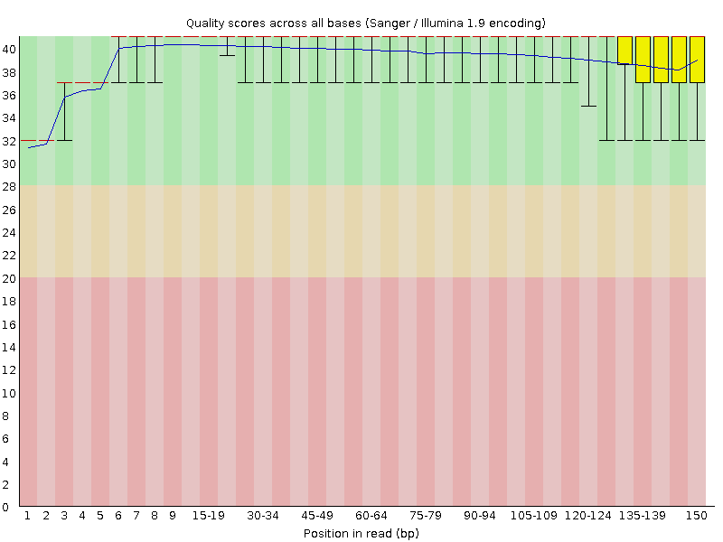

# Scaffa ChIP-seq Project read and alignment QC

* This report contains information regarding initial QC analyses for Alejandro Scaffa's ChIP-seq experiment.
* These experiments were performed on MLE-12 cells, a *Mus musculus* lung epithelial cell line.
* Chromatin was isolated from two biological replicates (GroupA and GroupB cultures) and immunoprecipitated using HO1, IgG, or a no-antibody control (LH20/H20), leading to 6 samples in total.
* Genewiz performed 150-BP PE sequencing with approximately 58 million reads per sample.


## Part 1: Raw reads summary table
Initial QC analyses of raw reads was performed in FastQC (V0.11.5)

| | | | | |
|:-----------------:|:-----------------:|:-----------------:|:-----------------:|:-----------------:|
| **Library**    | **# of Raw Reads**   | **Sequence Length**  | **# of poor quality sequences**  | **%GC**   |
| GroupA_LH20_1| 68331222| 150| 0| 43|
| GroupA_LH20_2| 68331222| 150| 0| 44|
| GroupA_IgG_1| 66702588| 150| 0| 43|
| GroupA_IgG_2| 66702588| 150| 0| 43|
| GroupA_HO1_1| 68697828| 150| 0| 43|
| GroupA_HO1_2| 68697828| 150| 0| 43|
| GroupB_H20_1| 72639136| 150| 0| 48|
| GroupB_H20_2| 72639136| 150| 0| 48|
| GroupB_IgG_1| 67845688| 150| 0| 42|
| GroupB_IgG_2| 67845688| 150| 0| 42|
| GroupB_HO1_1| 63918020| 150| 0| 43|
| GroupB_HO1_2| 63918020| 150| 0| 43|

Note the slightly higher GC content reported for the GroupB_H20_1 and GroupB_H20_2 libraries relative to the other 10.
To remove adapters, low-quality sequences, and short sequences, trimming was performed in Trimmomatic (V0.36) using the following parameters:
```
- trimmomatic:
    subcommand: PE
    options:
      "ILLUMINACLIP:/gpfs/data/cbc/cbc_conda_v1/envs/cbc_conda/opt/trimmomatic-0.36/adapters/TruSeq3-PE-2.fa:2:30:5:6:true":
      "SLIDINGWINDOW:10:25 MINLEN:75":
```

## Part 2: Trimmed reads summary table
A second QC analyses of trimmed reads was performed in FastQC (V0.11.5)

| | | | | |
|:-----------------:|:-----------------:|:-----------------:|:-----------------:|:-----------------:|
| **Library**    | **# of Raw Reads**   | **Sequence Length**  | **# of poor quality sequences**  | **%GC**   |
| GroupA_LH20_1 | 60123899 | 75-150 | 0 | 43 |
| GroupA_LH20_2 | 60123899 | 75-150 | 0 | 43 |
| GroupA_IgG_1 | 55572231 | 75-150 | 0 | 42 |
| GroupA_IgG_2 | 55572231 | 75-150 | 0 | 42 |
| GroupA_HO1_1 | 56866122 | 75-150 | 0 | 42 |
| GroupA_HO1_2 | 56866122 | 75-150 | 0 | 42 |
| GroupB_H20_1 | 61566544 | 75-150 | 0 | 47 |
| GroupB_H20_2 | 61566544 | 75-150 | 0 | 47 |
| GroupB_IgG_1 | 56522411 | 75-150 | 0 | 41 |
| GroupB_IgG_2 | 56522411 | 75-150 | 0 | 41 |
| GroupB_HO1_1 | 53668814 | 75-150 | 0 | 42 |
| GroupB_HO1_2 | 53668814 | 75-150 | 0 | 42 |

## Part 3: Read quality plots

| | | |
|:------:|:-----------:|:----------:|
| **Library** | **Raw reads**  | **Trimmed reads** |
| GroupA_LH20_1 |  |  |
| GroupA_LH20_2 |  |  |
| GroupA_IgG_1 |  |  |
| GroupA_IgG_2 |  |  |
| GroupA_HO1_1 |  |  |
| GroupA_HO1_2 |  |  |
| GroupB_H20_1 |  |  |
| GroupB_H20_2 |  |  |
| GroupB_IgG_1 |  |  |
| GroupB_IgG_2 |  |  |
| GroupB_HO1_1 |  |  |
| GroupB_HO1_2 |  |  |


## Part 4: GC content plots

| | | |
|:------:|:-----------:|:----------:|
| **Library** | **Raw reads**  | **Trimmed reads** |
| GroupA_LH20_1 |  |  |
| GroupA_LH20_2 |  |  |
| GroupA_IgG_1 |  |  |
| GroupA_IgG_2 |  |  |
| GroupA_HO1_1 |  |  |
| GroupA_HO1_2 |  |  |
| GroupB_H20_1 |  |  |
| GroupB_H20_2 |  |  |
| GroupB_IgG_1 |  |  |
| GroupB_IgG_2 |  |  |
| GroupB_HO1_1 |  |  |
| GroupB_HO1_2 |  |  |


## Part 5: Kmer content plots

| | | |
|:------:|:-----------:|:----------:|
| **Library** | **Raw reads**  | **Trimmed reads** |
| GroupA_LH20_1 |  | No enriched Kmers |
| GroupA_LH20_2 |  | No enriched Kmers |
| GroupA_IgG_1 |  | No enriched Kmers |
| GroupA_IgG_2 |  | No enriched Kmers |
| GroupA_HO1_1 |  |  |
| GroupA_HO1_2 |  | No enriched Kmers |
| GroupB_H20_1 |  | No enriched Kmers |
| GroupB_H20_2 |  | No enriched Kmers |
| GroupB_IgG_1 |  | No enriched Kmers |
| GroupB_IgG_2 |  | No enriched Kmers |
| GroupB_HO1_1 |  | No enriched Kmers |
| GroupB_HO1_2 |  | No enriched Kmers |

## Part 5A: Kmer content table - GroupA_HO1_1 Trimmed reads
| | | | | |
|:------------------:|:------------------:|:------------------:|:------------------:|:------------------:|
| **Sequence** | **Count** | **p-value** | **Obs/Exp Max** | **Max Obs/Exp Position** |
| TCCGATC | 6000 | 0.0 | 6.081754 | 3 |
| TTCCGAT | 6720 | 0.0 | 5.327682 | 2 |

## Part 6: Read QC summary
* Trimming improved the overall read quality scores (Part 3).
* All libraries have two peaks around 40% and 50% mean GC content. (Part 4).
* GroupB_H20_1 and GroupB_H20_2 libraries have an additional peak around 70% mean GC content, which is not mediated by trimming based on quality, adapter presence, or sequence length (Part 4).
* All raw reads show some degree of enrichmed kmers (adapter sequence) and most of the enriched kmers are removed after trimming (Part 5).
* GroupA_HO1 library still has some enriched kmers after trimming, but their counts are low (~6000), suggesting that they should not significantly impact downstream analyses (Part 5A).

## Part 7: Read alignment
* Trimmed reads were aligned against the Ensembl assembly GRCm38.p6 (`/gpfs/data/cbc/references/Ensembl_M_musculus.GRCm38.p6`).
* Reference indexing (`bwa index`)and read mapping (`bwa mem -M`) were performed in bwa (V0.7.15).
* Subsequent SAM conversion to BAM (`samtools view -Sbh`), as well as BAM sorting (`samtools sort`) and indexing (`samtools index`) were performed in Samtools (V1.9).
* Duplicates were marked (`MarkDuplicates`) and alignment statistics (`CollectAlignmentSummaryMetrics`, `CollectWGSMetrics`) were extracted using Picard tools (V2.9.2).
* For more information on Picard tools metrics reported here, see https://broadinstitute.github.io/picard/picard-metric-definitions.html

## Part 8: Alignment summary statistics

| | | |
|:---:|:---:|:---:|
| **LIBRARY** | **TOTAL_READS** | **READS_ALIGNED_IN_PAIRS** |
| GroupA_LH20 | 120247798 |  119552802 |
| GroupA_IgG | 111144462 |   109848730 |
| GroupA_HO1 | 113732244 |   110567302 |
| GroupB_H20 | 123133088 |   98219504 |
| GroupB_IgG | 113044822 |   112704592 |
| GroupB_HO1 | 107337628 |   105711984 |

* LIBRARY:	The library for which statistics are reported.
* TOTAL_READS:	The total number of reads including all PF and non-PF reads. When CATEGORY equals PAIR this value will be 2x the number of clusters.
* READS_ALIGNED_IN_PAIRS:	The number of aligned reads whose mate pair was also aligned to the reference.

## Part 9: WGS summary statistics

|  |  |  |  |  |  |  |  |  |  |
|:-------:| :-------: | :-------: | :-------: | :-------: | :-------: | :-------: | :-------: | :-------: | :-------: |
| **LIBRARY** | **MEAN_COVERAGE** | **SD_COVERAGE** | **PCT_EXC_MAPQ** | **PCT_EXC_UNPAIRED** | **PCT_EXC_BASEQ** | **PCT_EXC_OVERLAP** | **PCT_EXC_CAPPED** | **PCT_EXC_TOTAL** |
| GroupA_LH20 |  3.74 | 3.42 | 0.11  | 1.10E-04 | 7.14E-03 | 0.27 | 0.011 | 0.40 |
| GroupA_IgG |  3.67 | 3.24 | 0.12  | 1.60E-04 | 7.81E-03 | 0.20 | 0.013 | 0.34 |
| GroupA_HO1 |  3.80 | 3.40 | 0.11  | 3.64E-04 | 8.05E-03 | 0.20 | 0.013 | 0.33 |
| GroupB_H20 |  2.93 | 3.46 | 0.12  | 7.12E-04 | 7.55E-03 | 0.22 | 0.014 | 0.36 |
| GroupB_IgG |  3.98 | 3.33 | 0.11  | 7.50E-05 | 8.08E-03 | 0.18 | 0.013 | 0.32 |
| GroupB_HO1 |  3.39 | 3.08 | 0.11  | 1.92E-04 | 7.62E-03 | 0.22 | 0.013 | 0.36 |

* LIBRARY:	The library for which statistics are reported.
* MEAN_COVERAGE:	The mean coverage in bases of the genome territory, after all filters are applied.
* SD_COVERAGE:	The standard deviation of coverage of the genome after all filters are applied.
* MEDIAN_COVERAGE:	The median coverage in bases of the genome territory, after all filters are applied.
* PCT_EXC_MAPQ:	The fraction of aligned bases that were filtered out because they were in reads with low mapping quality (default is < 20).
* PCT_EXC_DUPE:	The fraction of aligned bases that were filtered out because they were in reads marked as duplicates.
* PCT_EXC_UNPAIRED:	The fraction of aligned bases that were filtered out because they were in reads without a mapped mate pair.
* PCT_EXC_BASEQ:	The fraction of aligned bases that were filtered out because they were of low base quality (default is < 20).
* PCT_EXC_OVERLAP:	The fraction of aligned bases that were filtered out because they were the second observation from an insert with overlapping reads.
* PCT_EXC_CAPPED:	The fraction of aligned bases that were filtered out because they would have raised coverage above the capped value (default cap = 250x).
* PCT_EXC_TOTAL:	The total fraction of aligned bases excluded due to all filters.

## Part 10: Duplication statistics

|  |  |  |  |  |  |
|  :-------:  | :-------: |  :-------:  |  :-------:  |  :-------:  |  :-------:  |
| **LIBRARY**  | **READ_PAIRS_EXAMINED** | **SECONDARY_OR_SUPPLEMENTARY_RDS** | **UNMAPPED_READS**  | **PERCENT_DUPLICATION** | **ESTIMATED_LIBRARY_SIZE** |
| GroupA_LH20  | 59776401 | 681633 | 659975   | 0.16 | 178349158 |
| GroupA_IgG  | 54924365 | 604280 | 1264843  | 0.18 | 135069209 |
| GroupA_HO1  | 55283651 | 649083 | 3101149  | 0.22 | 110761630 |
| GroupB_H20  | 49109752 | 415352 | 24781602  | 0.38 | 47614157 |
| GroupB_IgG | 56352296 | 581808 | 320129  | 0.15 | 172478062 |
| GroupB_HO1  | 52855992 | 607151 | 1592490  | 0.17 | 138855851 |

* LIBRARY:	The library on which the duplicate marking was performed.
* READ_PAIRS_EXAMINED:	The number of mapped read pairs examined.
* SECONDARY_OR_SUPPLEMENTARY_RDS:	The number of reads that were either secondary or supplementary
* UNMAPPED_READS: The total number of unmapped reads examined.
* PERCENT_DUPLICATION:	The fraction of mapped sequence that is marked as duplicate.
* ESTIMATED_LIBRARY_SIZE:	The estimated number of unique molecules in the library based on PE duplication.

## Part 11: Alignment Summary
* Most of the reads align to the reference in pairs (Part 8).
* Most of the reads that were filtered out were removed because they are the second read in an overlapping pair ('PCT_EXC_OVERLAP') or the mapping quality was not suffienctly high ('PCT_EXC_MAPQ')(Part 9).
* The GroupB_H20 PE library had more unmapped reads ('UNMAPPED_READS'), slightly higher rates of read duplication ('PERCENT_DUPLICATION'), and a smaller estimated library size ('ESTIMATED_LIBRARY_SIZE') than the other 5 PE libraries (Part 10).
